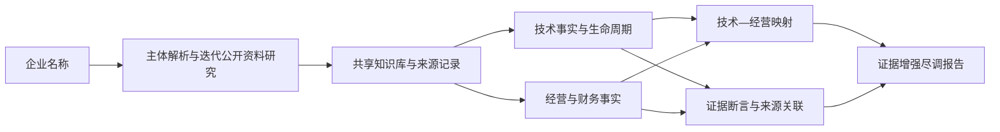

# 科衡 KeHeng

**面向科技金融尽调的证据增强 AI 辅助分析系统。**

输入企业名称，科衡研究公开资料，将技术事实、经营与财务事实、技术生命周期与金融关注事项组织为可以回到原始来源的报告。系统服务于公开资料预尽调和持续监测，结果需要业务人员复核。

[文档导航](docs/README.md) · [MIT 代码许可](LICENSE)

## 系统流程



- **公开资料研究**：围绕企业身份、技术与业务线索多轮检索，记录来源类型、质量和可用内容。
- **技术分析**：按行业模板组织技术事实、生命周期节点、证据状态和信息缺口。
- **技术—经营分析**：通过显式规则连接技术阶段、资金活动、风险观察和监测节点。
- **证据回溯**：从报告到断言、事实、知识片段及原始来源，区分多来源支持、冲突和有限支持。
- **持久化报告**：按企业保存结果，支持重新打开与刷新已保存报告。

前端使用 React、TypeScript、Vite；后端使用 FastAPI。当前主流程通过兼容 OpenAI 的结构化模型接口及 Tavily 获取和理解公开资料，共享知识库保存在本地 `runtime/knowledge/`。旧 PDF 分析与评分接口仍保留兼容用途，首页使用企业名称分析流程。

## 本地运行

需要 Python 3.12+、Node.js 22.12+、npm，以及可用的模型和 Tavily 服务。首次安装需要访问软件包仓库，真实分析会产生外部 API 调用与费用。

从仓库根目录执行 Windows PowerShell 命令：

```powershell
py -3.12 -m venv backend/.venv
backend/.venv/Scripts/python.exe -m pip install -r backend/requirements-lock.txt
# 仅在文件不存在时复制，避免覆盖已有配置
if (-not (Test-Path backend/.env)) { Copy-Item backend/.env.example backend/.env }
```

在本地 `backend/.env` 填写连接配置：

| 配置 | 用途 |
|---|---|
| `KEHENG_LLM_ENDPOINT` | 模型实际兼容接口地址 |
| `KEHENG_LLM_MODEL` | 供应商提供的模型名称 |
| `KEHENG_LLM_API_KEY` | 后端模型凭据 |
| `KEHENG_LLM_TIMEOUT_SECONDS` | 模型请求超时，默认 120 秒 |
| `KEHENG_LLM_ENABLE_THINKING` | 可选；未设置不发送该字段，`true` / `false` 显式传递 |
| `KEHENG_WEB_SEARCH_PROVIDER` | 当前支持 `tavily` |
| `KEHENG_TAVILY_API_KEY` | Tavily 凭据 |
| `KEHENG_TAVILY_SEARCH_DEPTH` | `basic` / `advanced`，默认 `advanced` |
| `KEHENG_WEB_SEARCH_TIMEOUT_SECONDS` | 搜索请求超时，默认 30 秒 |

密钥只保留在后端本地环境，不放入前端、论文或版本库。完整配置见 [backend/.env.example](backend/.env.example)。企业名称分析缺少必要服务配置时返回配置错误。

```powershell
# 终端 1：从仓库根目录启动后端
backend/.venv/Scripts/python.exe -m uvicorn app.main:app --app-dir backend --host 127.0.0.1 --port 8000

# 终端 2：启动前端
cd frontend
npm ci
npm run dev -- --host 127.0.0.1
```

打开 <http://127.0.0.1:5173>。接口说明：<http://127.0.0.1:8000/docs>。Linux/macOS 将 Python 路径替换为 `backend/.venv/bin/python`。

## 接口与结果保存

| 接口 | 功能 |
|---|---|
| `POST /api/evidence-analysis` | 用 `{"enterprise_name":"企业名称"}` 启动分析 |
| `GET /api/evidence-analysis/{task_id}` | 查询任务状态及完成结果 |
| `GET /api/report/v2/company/{company_id}` | 读取企业已保存报告 |

任务状态保存在后端进程内，服务重启后不能恢复正在执行的任务；已完成的知识与分析结果存入 `runtime/knowledge/`。前端用 `/?company_id=<编码后的企业ID>` 重新打开报告。“刷新已保存报告”读取已有结果，不重新进行网络研究。

## 仓库导航

| 目录 | 内容 |
|---|---|
| [frontend/](frontend/README.md) | 企业名称入口、任务状态与证据报告界面 |
| [backend/](backend/README.md) | API、任务编排、配置及领域实现 |
| `backend/app/knowledge/` | 来源契约、共享知识库、主体解析与证据断言 |
| `backend/app/research/` | 迭代检索、来源识别与企业主体解析 |
| `backend/app/knowledge/semantic/`、`backend/app/finance/` | 技术事实、生命周期及科技金融处理 |
| `backend/app/services/` | 正式分析链路与报告组装 |
| `tests/`、`scripts/` | 离线回归、运行诊断与快照回放工具 |
| `configs/`、`evaluation/`、`rag/`、`agents/` | 配置、旧版分析能力及模块说明 |
| [data/](data/DATA_SOURCES.md) | 合成样例、数据来源说明与评测材料清单 |
| [docs/](docs/README.md) | 文档导航及保留的设计、评测记录 |

`runtime/`、密钥、本地企业材料、虚拟环境、构建缓存及参赛材料不进入版本库。现有目录边界保留，避免为文档整理改变程序路径。

## 检查与复现

```powershell
# 完整后端离线测试：在独立环境执行，避免真实 provider 配置污染测试
backend/.venv/Scripts/python.exe -m unittest discover -s tests -p "test_*.py" -v

# 前端构建
cd frontend
npm ci
npm run build
```

[CI](.github/workflows/ci.yml) 执行固定离线回归集合与前端构建，不调用真实模型和搜索服务，也不等同于完整真实端到端验收。真实检查脚本为 `scripts/run_end_to_end_review.py`，需要本地服务配置；重新检索的来源与结果可能不同。

## 使用边界与许可

项目代码采用 MIT 许可，外部来源内容的权利归原权利人。公开来源需要人工核验，报告不是授信、投资或风险裁决。当前实现面向本地研究使用，生产部署所需的身份认证、权限、数据隔离和审计策略需要另行落实。
