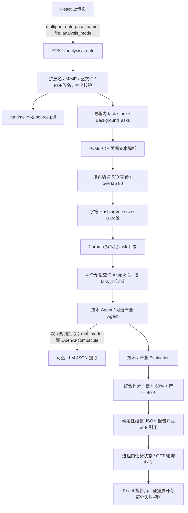

# KeHeng 项目现状审计（V2 规划基线）

- 审计日期：2026-09-29
- 审计范围：当前工作区的源代码、配置、测试和文件状态；README 与既有设计文档仅用于检查差异，不作为实现证据。
- 方法：只读检查仓库并运行现有后端测试、前端构建。未修改现有源代码、配置、数据或原有文档；本任务新增本审计文件。前端构建按其工作方式重生成了被 `.gitignore` 忽略的 `frontend/dist/` 资源和 TypeScript build info（它们不是源码交付物）。
- 结论边界：下文的“实现”均指审计时仓库代码；环境模型请求没有实际发送。本机 `runtime/`、`tmp/`、虚拟环境和 node_modules 等忽略目录不作为公开源码。

## 1. 项目整体结构

### 1.1 当前技术栈

| 项目 | 代码现状 |
| --- | --- |
| 前端 | React 19、TypeScript 5、Vite 7；单个主组件根据状态显示上传、部分结果或报告。依赖定义在 `frontend/package.json`。 |
| 后端 | Python 3.12 目标、FastAPI、Pydantic v2 / pydantic-settings、Uvicorn；模块化单体。依赖在 `backend/requirements.txt` 和锁定文件。 |
| 关系数据库 | 当前没有关系数据库读写或 ORM。任务在进程内字典中，服务重启后丢失。`configs/database.yaml` 是规划模板，不是运行时连接配置。 |
| 向量库 | Chroma PersistentClient；生产式规则/真实模型路径按 task 建立本地持久目录。BM25 候选实现是 Python 进程内存储。 |
| LLM Provider | 可选 OpenAI-compatible Chat Completions HTTP 适配器；运行时要求环境变量提供 endpoint、model、key。默认走规则模式。测试和评测另有 mock/provider doubles。 |
| Embedding | 默认 `LocalHashingEmbeddingProvider`：sklearn `HashingVectorizer` 字符 n-gram（2–4），1024 维，L2 归一化；不下载模型，不是语义 embedding 模型。BM25 模式不使用 embedding。 |
| RAG | 文本型 PDF 解析、按页切块、task 隔离的 Chroma 向量检索或可选 BM25 检索、固定查询组、证据上下文装配。无联网检索和生成式检索迭代。 |
| PDF 解析 | PyMuPDF（`pymupdf`），提取可选中的页面文本；无 OCR。 |
| 报告 | 后端确定性组装 Pydantic JSON；无 PDF/Word 渲染输出。前端渲染 HTML 报告。 |
| Evaluation | 根目录 `evaluation/` 的 YAML 驱动确定性引擎：技术、产业及综合分。Agent 产生指标观察；Evaluation Engine 负责加权计算。 |
| 测试 | 14 个 `tests/test_*.py` unittest 文件；GitHub Actions workflow；前端 `tsc -b && vite build`。未见独立 E2E 浏览器测试框架或在线模型评测门禁。 |

### 1.2 主要目录

```text
.
├── backend/app/       FastAPI、服务编排、Agent、LLM、RAG、报告与 API 契约
├── configs/            YAML 配置样板；部分内容是规划说明，运行时未加载
├── data/               合成演示和评测样本；真实企业来源文件及人工复核数据被 ignore
├── docs/               项目设计、实验、评审与交接文档；历史描述需与代码区分
├── evaluation/         当前实际评分引擎、权重、固定样本和实验脚本
├── frontend/           React 页面、构建配置和静态虚构示例报告
├── prompts/            技术、产业 LLM 提取提示词
├── scripts/            Demo、合成 PDF、案例准备等脚本
├── tests/              后端 unittest 固定回归
├── agents/             分域目录骨架；当前可运行实现实际在 backend/app/agents/
├── rag/                分层目录骨架；当前实现实际在 backend/app/rag/
├── paper/              论文源文件、模板、图、PDF 和字体；公开许可需另核
├── .github/workflows/  CI 配置
└── AGENTS.md           本项目开发与治理约束
```

关键文件：`backend/app/main.py` 是 FastAPI 入口；`backend/app/api/routes/analysis.py` 提供上传与任务查询；`backend/app/services/analysis_service.py` 编排主要链路；`backend/app/services/analysis_tasks.py` 实现进程内任务状态；`backend/app/rag/` 实现解析、embedding、Chroma/BM25、检索和上下文；`backend/app/agents/technology_agent.py` 与 `industry_agent.py` 负责观察提取；`evaluation/` 负责评分；`backend/app/report/` 负责报告组装；`frontend/src/App.tsx` 是主要交互与报告组件。

`agents/`、`rag/` 根目录目前是空/近空的子目录骨架，不是实际运行模块。`configs/model.yaml`、`database.yaml`、`system.yaml` 是描述性模板；Settings 实际读取 `KEHENG_` 环境变量与 `backend/.env`，没有加载这些 YAML。

## 2. 当前完整执行链路

实际产品入口是 `POST /analysis/create` → 后台任务 → `GET /analysis/{task_id}` 轮询。规则演示只运行技术模块；`real_model` 模式按顺序尝试技术及产业模块。接口允许一个、最大 20 MB 的 PDF。



1. **上传**：`frontend/src/App.tsx` 提交 `multipart/form-data`，包括企业名、PDF 和 `analysis_mode`。`analysis.py` 校验扩展名、MIME、最大大小、空文件和 `%PDF-` 签名，写到 `runtime/analysis/uploads/<task_id>/source.pdf`。任务 ID 是 UUID hex。
2. **解析**：`PdfDocumentParser` 用 PyMuPDF 按页提取并规范化文本，记录页码、源文件 SHA-256、页数和 parser 版本。加密 PDF、损坏 PDF、无文本 PDF 报错；扫描件 OCR 当前未实现。
3. **切分**：服务实际传 `chunk_size=520`、`chunk_overlap=80`；切分不会跨页，优先在换行/标点附近断开。解析器类默认值为 600/100，但产品服务覆盖为 520/80。
4. **Chunk 结构**：`DocumentChunk` 含 `task_id, document_id, document_name, page_number, chunk_id, text, locator, metadata`。chunk_id 是 task/document/source hash/page/index/text 的 SHA-256 前 24 位；locator 为“第 N 页 / 片段 M”。
5. **Embedding / 写入**：hash 模式对每个 chunk 文本生成 1024 维局部字符 n-gram 向量，写入 Chroma 的 vectors、documents 与 metadata。metadata 包含任务/文档/页码/chunk_id/locator/embedding 版本；不包含原文件字节。BM25 模式直接保存 chunk 对象并在内存计算词项排序。
6. **检索**：技术和产业 Agent 各自有 4 条查询，每条 top-k 默认 3；检索按 `task_id` 过滤、可选 `document_ids` 过滤，跨查询按 chunk_id 去重并记录查询组。hash 使用 Chroma cosine 距离；BM25 实现中文相邻二元词和英文/数字 token。产品选择 hash 或 BM25，不是混合检索。
7. **上下文与重排**：LLM 发送前最多 8 chunks / 4,160 字符，由 `balanced_sentences_v1` 按查询组均衡、去重句子且不截断句子。它是上下文选择与压缩，不是单独学习式 reranker。没有 multi-turn retrieval。
8. **Agent 与 LLM**：默认设置 `agent_mode=rule`。技术规则根据检索证据关键字生成四项观察；真实模型模式用 `TechnologyAgent`、`IndustryAgent` 的独立调用。LLM prompt 由 `prompts/technology_agent_prompt.md`、`prompts/industry_agent_prompt.md` 读取；Provider 将其作为 system message，证据 JSON 作为 user message。每个 Agent 输出均通过 Pydantic 契约，并校验指标和摘要引用是否属于给定 E 编号。LLM 不产总分。
9. **指标与评分**：技术指标由 Technology Agent 提取；产业指标由 Industry Agent 提取（规则或 LLM）。技术、产业 Evaluation Engine 验证引用 ID 与有分值指标的证据，再按 YAML 权重对可评分指标归一化加权。综合层要求技术分和产业分都存在才生成 overall；固定使用 60/40，不对一级维度缺失重新归一化。
10. **报告**：`ReportGenerator` / `ComprehensiveReportGenerator` 将分析、分数、优势风险及证据合并为 JSON。校验摘要、已评分指标、发现与 evidence_mapping 的 E 编号是否能映射到 report references。报告中引用包含文档名、页码、chunk_id、摘录和检索分。没有 PDF 导出器。
11. **前端展示**：前端每秒轮询，最多 120 次；报告页显示分数、维度、发现、技术/产业指标、运行配置与可展开证据。支持模块失败独立展示。静态合成报告可由用户主动加载；本机历史回放是依赖 `runtime/` 的可选读文件入口，不是历史报告数据库。

**字段传递边界**：`task_id/document_id/page_number/chunk_id` 从 `DocumentSource` 到 chunk、retrieved evidence；Agent 给被引用 chunk 分配 `E1..En`，输出的 evidence 记录为文档名、页、chunk_id、excerpt、retrieval_score、supports。评分的 evidence_mapping 使用 E ID，报告 `references` 保存位置与原文摘录，前端用 E ID 展示。文件 hash 留在解析元数据/向量 metadata。报告证据对象不含完整 `DocumentSource`、本地路径、source URI 或独立 citation 对象；LLM citation 是 E 编号及结构校验，不会验证语义支持。

## 3. Knowledge / Evidence 数据结构

| 概念 | 定义与字段 | 读写位置与可追溯性 |
| --- | --- | --- |
| document/source | `backend/app/rag/document_parser.py:DocumentSource(task_id, document_id, file_name, content_type, local_path)`；`ParsedDocument(source, document_name, pages, metadata)` | 上传路由创建任务与文件；Parser 读取文件并生成页。页码及文件 hash 可追溯至上传 PDF；仅有本地路径，不是通用来源身份。 |
| chunk | 同文件 `DocumentChunk(task_id, document_id, document_name, page_number?, chunk_id, text, locator, metadata)` | Parser 生成；knowledge base 写入 Chroma/BM25；retriever 查询。含 PDF 页码、原文 chunk、文件 hash，能定位页面/片段。 |
| evidence | `backend/app/agents/technology_agent.py:TechnologyEvidence`、`industry_agent.py:IndustryEvidence`：`evidence_id, document_name, page_number?, chunk_id, excerpt, retrieval_score, supports` | Agent 从检索片段创建；报告与 API 响应透传。当前能回指 PDF 页和原文摘录，但没有直接存储 document URI/hash/page span。 |
| citation | 没有单独持久化 citation 模型。Agent/LLM 结果使用 `E1` 字符串列表；文本中的 `[E1]` 也会被校验；报告把 ID 解析到 `ReportEvidence`。 | `technology_agent.py`、`industry_agent.py`、`report/generator.py`、评分模块。可追溯到当前任务的 report reference 和页码/chunk；E ID 是任务内临时序号，不是长期稳定引用 ID。 |
| indicator | `TechnologyIndicatorAssessment(score?, evidence[], rationale)`；`IndustryIndicatorAssessment` 同型；技术 4 项、产业 4 项。 | 两个 Agent 产出，两个 Evaluation Engine 读取；每项可有 E 引用和理由，LLM schema 还定义 confidence，但规则及公开 Agent 结果模型未保留 confidence。 |
| score | `evaluation/scoring.py`、`industry_scoring.py`、`composite_scoring.py` 的结果对象：总分、维度分、score_explanation、evidence_mapping、配置版本/状态/覆盖率等。 | 由确定性引擎计算并嵌入报告；evidence_mapping 可回到 E ID。不是独立数据库实体。 |
| report | `backend/app/report/generator.py:TechnologyReport`；`report/comprehensive.py:ComprehensiveReport`。含 task/company 名、标题、摘要、技术/产业/综合分、状态、覆盖率、维度、优势、风险、指标、评估详情、references。 | 分析服务组装并保存在进程内 Task response；前端读取。references 含页码、chunk_id、excerpt。无版本库或持久化 report 表。 |
| task | `backend/app/services/analysis_tasks.py:AnalysisTaskResponse`：task_id、status、enterprise_name、file_name、report、modules、module_failures、result_status、run_info、model_io、request_mode、error。状态枚举 processing/completed/failed/partial。 | 进程内字典；文件和 Chroma 另存本地。重启后 task 状态/API 历史不可恢复；没有权限主体/user_id。 |
| company | 没有单独 Company 持久化模型/表。`enterprise_name` 只是请求、task、report 上的字符串。 | 上传前端和分析接口接受；未规范化企业实体、统一社会信用代码或 company_id；跨任务没有公司聚合层。 |

**未来多源适配性**：当前 source 结构不能自然表达网页 URL、专利、论文、政府公示等来源。缺少 source_type/provider、canonical URI、标题/发布机构、发布时间/抓取时间、许可、内容 hash、外部 ID、版本、网页锚点/页码、来源可信度等统一字段。`local_path/file_name` 与 `page_number/locator` 偏 PDF 文件定位。当前 `metadata: dict[str,str]` 可临时塞扩展属性，但没有稳定契约或验证。

## 4. RAG 能力审计

| 项 | 当前实现 | 代码位置 |
| --- | --- | --- |
| 检索方式 | hash 模式为向量 cosine；`bm25` 为关键词 BM25。通过配置二选一，非混合。 | `backend/app/rag/knowledge_base.py`、`bm25.py`、`analysis_service.py` |
| embedding | 本地 HashingVectorizer，char 2–4 gram，1024 维，L2。BM25 不使用。 | `backend/app/rag/embedding.py` |
| chunk | 产品 520 字符，overlap 80，按页；Parser 类默认 600/100。 | `document_parser.py`、`analysis_service.py` |
| top-k | 每 Agent 每查询 3，4 条查询；`RetrievalQuery` 可取 1–20，Agent 请求约束 1–10。 | `agents/technology_agent.py`、`industry_agent.py`、`retrieval.py` |
| metadata filter | 强制 `task_id`；可选按 `document_ids` 过滤。不是基于行业/来源/日期等知识层级的丰富过滤。 | `knowledge_base.py:_build_where`、`retrieval.py` |
| query rewrite / expansion | 无运行时 LLM query rewrite 或 query expansion。可切换 `original` 或静态 bilingual 查询模式；后者使用 JSON 内预定义中英词组。 | `query_definitions.py`、`evaluation/retrieval_indicator_definitions.json`、Agent 构造器 |
| rerank | 没有独立 cross-encoder/LLM reranker。上下文 assembly 均衡查询组、去重句子。 | `context_assembly.py` |
| 多轮检索 | 当前请求中多个固定查询并去重；没有“结果驱动新 query 再搜”的迭代循环。 | 两个 Agent `_retrieve` |
| 网络检索/网页抓取 | 当前产品没有；见第 7 节。 | 产品服务与依赖无运行时 Web Search/爬虫模块 |
| 增量更新 | Chroma `upsert` 和 `delete_document` 接口可增删一个 task 文档；产品上传按一个 task 一个 PDF 创建索引，没有常驻多租户知识库/采集调度。BM25 是内存实现。 | `knowledge_base.py`、`bm25.py` |
| 持久化 | Chroma 本地 persistent path；不是集中服务/共享知识库。 | `analysis_service.py`、`analysis_tasks.py` |
| task/company 隔离 | 每个 task 有专属 Chroma 目录并且查询带 task_id；BM25 每次运行新实例也按 task_id 筛选。没有 company_id 层或用户权限隔离。 | `analysis_service.py`、`knowledge_base.py`、`bm25.py` |

## 5. LLM 能力与调用点

生产产品当前只有两个 Agent 提取调用。`ReportAgent`、`FinanceAgent` 是接口/占位，没有 LLM 调用。评测脚本可显式建立相同 OpenAI-compatible HTTP Provider，对固定样本进行实验；它们不是网页产品请求链路。

| 调用位置/作用 | 模型 | Prompt 文件/代码 | 输入与输出 |
| --- | --- | --- | --- |
| `TechnologyAgent.analyze` 技术摘要、优势/风险和四项技术观察 | 从 `KEHENG_LLM_MODEL` 配置的 OpenAI-compatible 模型；未硬编码模型名 | `prompts/technology_agent_prompt.md`，Agent `_load_prompt()` | `LLMExtractionRequest(task_id, enterprise_name, chunks[E编号/文档/页/chunk/excerpt/retrieval_score], prompt, context_assembly)` → `LLMExtractionResult(summary/status/summary evidence/四指标/findings)` |
| `IndustryAgent.analyze` 四项产业观察 | 同一 Provider/model | `prompts/industry_agent_prompt.md`，Agent `_load_prompt()` | 同类 request → `LLMIndustryExtractionResult(industry_indicators)` |
| API 实际传输 | Chat Completions OpenAI-compatible | `backend/app/llm/api_model.py` | system=Prompt、user=序列化证据；默认 JSON response_format，temperature 0。默认产品 Provider 重试 0 次、schema 修复最多一次；底层 transport 默认 max retries 2 但产品构造覆盖为 0。 |
| 实验调用 | endpoint/model 从实验显式配置/环境读取 | `evaluation/evaluate_real_llm.py`、`evaluation/run_v09_experiments.py`、`run_paired_model_experiment.py` 等 | 固定案例、多轮重复/对比；与产品 UI 对话无关。 |

**结构校验与失败处理**：JSON object 解码后由 Pydantic `model_validate` 校验类型、范围及必需字段；Agent 继续验证指标集合、未知 E 编号、带分数指标必须有引用、摘要/理由中的引用绑定关系。结构/JSON 错误可触发一次格式修复，并明确禁止补事实/分数/引用；最终错误保留为模块失败或 task 失败，不自动退回规则模式。规则模式需用户显式选定。无法判断时 Prompt 规定 null/“证据不足”。引用存在性校验不等于证据语义支持校验，仍不能排除 hallucination。

没有连续对话接口、chat message schema、conversation_id 或持久 conversation history。Transport 保存本进程 request/response histories；`AnalysisTaskResponse.model_io` 可带回当前任务请求和 raw response（包含发给模型的证据摘录），这是审计数据而非聊天记忆。task 状态和这些记录仅在进程内。

## 6. 当前评分体系

### 6.1 技术、产业指标

- **技术指标**（`evaluation/indicators.yaml`、`weights.yaml`）：技术自主性 25%、创新能力 30%、知识产权能力 20%、技术成熟度 25%。维度为创新（自主性 + 创新能力）、知识产权、成熟度。
- **产业指标**（`evaluation/industry/indicators.yaml`、`weights.yaml`）：市场潜力 30%、行业成长性 25%、竞争位置 25%、政策环境 20%；属于产业价值维度。
- 技术规则抽取在 `technology_agent.py`：按命中证据/关键词阈值产生 0–100 指标分；没有足够命中就不评分。产业规则匹配在 `industry_agent.py`。显式 real_model 模式下 LLM 产生 indicator score/rationale/evidence_ids；规则 demo 不运行产业 Agent。
- 根目录配置 `evaluation/weights.yaml` 和 `evaluation/industry/weights.yaml` 指标权重均和为 1。Engine 对缺失/无效引用的指标不按 0 分处理，仅在有证据的可评分指标上按其可用权重归一化。证据覆盖和每项 score explanation/evidence_mapping 输出到报告。
- **综合分**（`evaluation/composite_weights.yaml`）：技术 60%、产业 40%。缺任一一级维度分时 overall 为 null、状态 insufficient_evidence；两者都有分时固定 60/40 计算，即使局部覆盖不足也不重分配一级权重。覆盖完整度用 evidence mapping 计算。

### 6.2 旧版逻辑识别

当前指标名、报告名和界面分数明确属于“科技企业技术/产业价值评估”及早期融资尽调原型。技术四项固定权重与产业四项固定权重、技术/产业 60/40 综合分是旧综合评分核心。`configs/system.yaml` 仍写尽调评估；`README.md` 介绍科技企业融资尽调。此处仅描述，未做评分体系评价。

报告生成器不会重新判断或计算指标，只把 Agent 与 Engine 已有输出转成报告并校验 E 引用。因此评分和报告输入有契约耦合，实际业务链路由 `analysis_service.py` 顺序调用。

## 7. 联网与外部数据能力

运行产品路径没有搜索引擎、Web Search、网页抓取、URL 正文解析、专利/论文/新闻 API 或官网抓取；没有可配置搜索服务凭据或来源存储结构。产品端不会因知识不足发起外部查询。

仓库的 `scripts/prepare_real_cases.py` 会按脚本内静态 URL 下载指定上市公司年报到本地 `data/real_cases/*/sources/`，属于离线案例准备脚本，不是产品运行时联网搜索/增量知识更新链路。实验脚本还会请求显式配置的 LLM API。

**当前项目没有外部互联网知识获取链路。**

## 8. 前端页面与路由

前端没有 React Router；`frontend/src/App.tsx` 是状态切换式单页。

| 页面/状态 | 实际功能 | 组件/接口 |
| --- | --- | --- |
| 上传页 | 企业名、PDF 选择、规则演示/真实模型切换、上传进度；虚构样例加载；可选本机 NIO 历史结果回放。 | `UploadPage`；`POST /analysis/create` |
| 分析中 | 页内状态和 task ID；每秒轮询，最多 120 秒。刷新页面不恢复 task。 | `App.pollTask`；`GET /analysis/{task_id}` |
| 报告页 | 综合/技术报告摘要、分数、指标、优势、风险、运行信息、证据展开（E ID、页码、chunk、摘录和检索相关度）。 | `ReportPage`、`EvidenceDisclosure`、`FindingSection`、`DomainIndicatorPanel` |
| 部分结果页 | 保留成功模块、显示失败模块诊断和已成功域指标。 | `PartialResultPage`、`ModuleFailureNotice` |

后端 HTTP 路由包括 `/health`、`/analysis/demo-material`、`/analysis/replays/...`、`POST /analysis/create`、`GET /analysis/{task_id}`、`POST /report/generate`。没有历史报告列表/查询库、聊天页面/连续对话 UI、知识库管理/更新界面、编辑与人工复核工作台。`frontend/public/technology_report.json` 是可主动加载的固定合成报告。

## 9. 运行与测试状态

- **启动命令**：README 的 Windows 方式为 `py -3.12 -m venv backend/.venv`，安装 `backend/requirements-lock.txt`，再运行 `backend/.venv/Scripts/python.exe -m uvicorn app.main:app --app-dir backend --host 127.0.0.1 --port 8000`；前端 `cd frontend; npm ci; npm run dev -- --host 127.0.0.1`。
- **必要环境**：Python 3.12+、Node 22+ / npm。默认规则演示不需 LLM API。`real_model` 需 `KEHENG_AGENT_MODE=llm` 相关设置（UI 选择 real_model）并填写 `KEHENG_LLM_ENDPOINT`、`KEHENG_LLM_MODEL`、`KEHENG_LLM_API_KEY`；可调 `KEHENG_LLM_TIMEOUT_SECONDS`。默认 `KEHENG_RETRIEVAL_MODE=hash`，可设 `bm25`。配置定义在 `backend/app/core/config.py`，模板 `backend/.env.example`。
- **测试数量**：14 个 unittest 文件、共运行 63 个测试。使用 `backend/.venv/Scripts/python.exe -m unittest discover -s tests -p "test_*.py" -v`：62 通过、1 失败。失败 `tests/test_technology_pipeline.py::test_pdf_to_evidence_bound_indicators`，期望输出集合不含 `summary_status`，与当前模型新增字段契约不符。运行期间出现 Starlette TestClient/httpx 弃用警告。未为通过测试修改代码。
- 首次用全局 `py -3.12` 运行时因缺少 `pymupdf`、Pydantic、FastAPI 等依赖导致导入失败；随后使用仓库虚拟环境运行完整测试，结果如上。
- **前端构建**：`npm run build` 成功；TypeScript 检查及 Vite 构建完成。该检查重生成了 `frontend/dist/` 与 `*.tsbuildinfo` 忽略产物，不影响前端源文件。
- **固定 Demo**：`data/examples/public_test_company_technology_profile.pdf` 和合成期望输出；`data/evaluation_cases/` 的固定合成 PDF 案例；`frontend/public/technology_report.json`。
- **历史运行结果**：本地 `runtime/` 中存在 demo、real LLM 实验、公司案例运行、检索/上下文评审及 Chroma 索引等结果；均被 `.gitignore` 的 `runtime/` 忽略。当前机器的历史结果不等于干净克隆具备的文件。
- **CI**：`.github/workflows/ci.yml`；源码含 Python 测试和前端构建流程。未单独执行 GitHub Actions。

## 10. GitHub 上传前检查

### 10.1 工作区与文件风险

审计时 `git status` 显示 `No commits yet on master`，项目文件整体为未跟踪状态；`git remote -v` 无输出，仓库没有配置远端。用户提供的 `git@github.com:lori314/KeHeng.git` 尚未写入 Git 配置，也未验证权限/目标仓库内容。工作区另有大量被忽略的 `runtime/`、`tmp/`、`.venv`、`node_modules` 和构建产物。不能将“被 ignore”误认为已安全提交；首次 `git add` 范围需要明确审阅。

- 未发现实际 `backend/.env`、密钥文件扩展名或常见 API key/private-key 模式匹配；存在的 `backend/.env.example` 为空密钥占位模板。静态扫描只能识别常见形式，不能替代逐文件发布审查。
- `data/real_cases/*/sources/` 的真实公司年报 PDF、`data/real_cases/human_review_v10.csv`、`runtime/`、`tmp/` 均被当前 `.gitignore` 排除。不要用 `git add -f` 提交。
- 忽略目录当前体量明显大，包括多份 Chroma SQLite/索引库和旧实验输出。`tmp/` 还有字体 PDF；`runtime/` 有历史 raw runs / reports 与公司资料派生向量。
- 未发现文本源码中的 `C:\Users\...`、`F:\Users\...` 等个人本机绝对路径命中。程序运行时自行解析项目根目录路径。
- 未在仓库源码/文档中发现常见密钥正则命中。需注意 `runtime` 中的 raw request/response 和 `model_io` 可能含企业摘录，不适合公开。
- `paper/` 中存在若干 PDF（单个约 0.5–3.3 MB）、重复字体 TTF（最大约 9.75 MB）及图像/论文模板；当前 ignore 未屏蔽这些提交候选。论文内容、署名、院校/竞赛信息、字体和图示再分发许可都需要项目维护者确认。

### 10.2 分类清单

**必须加入 `.gitignore` / 保持排除**

- 当前 `.gitignore` 已覆盖 `.env`（保留 `.env.example`）、`.venv/`、`node_modules/`、`frontend/dist/`、`runtime/`、`tmp/`、`*.db`/SQLite、Python/pytest 缓存、LaTeX 中间文件，以及真实年报来源目录和人工复核 CSV。确认这些规则保留有效。
- 上传前应对未覆盖的生成文件做逐路径规则：尤其 `paper/` 生成的 PDF/编译文件、重复模板字体/缓存（若未取得再分发许可）；不要全局忽略合成 PDF，因为 `data/examples` 与 `data/evaluation_cases` 有测试依赖。
- 对新增模型 raw、下载原文、用户上传件、人工标注/复核材料延续默认忽略策略；只提交经确认的脱敏合成样本。

**可以公开（确认来源属性后）**

- `backend/app/`、`frontend/src/`、`evaluation/` 引擎与配置、`prompts/`、`tests/`、构建依赖锁文件、`.env.example`、`configs/` 模板、许可证和必要的架构/使用说明。
- `data/examples/` 和 `data/evaluation_cases/` 中有 README 声明的项目自有合成材料；公开前保留其合成来源说明。静态报告只含虚构案例时可公开。
- `scripts/prepare_real_cases.py` 的下载脚本、公开年报来源 URL/manifest 可以作为来源说明公开，但这不代表可以再分发下载到的年报原文。

**不建议公开**

- `runtime/`、`tmp/`、实际 `.env` / credentials、向量库、模型 raw responses、历史运行目录、上传资料和人工 review 标签；即使 ignore 已覆盖也不要强制添加。
- `data/real_cases/*/sources/*.pdf`、`data/real_cases/human_review*.csv`；当前已有 ignore 规则，应继续排除。
- 未经许可的论文 PDF、竞赛提交件、出版模板及字体文件；根仓库有多个可能重复/衍生版本。

**需要人工确认**

- `paper/` 下的 `main.pdf`、`main_icbc*.pdf`、`KeHeng_ICBC.pdf`、竞赛目录及论文署名/个人信息、图表和字体许可/来源。
- README 当前描述与实现差异、LICENSE 对全仓材料是否适用、所有第三方文件/图片/字体授权。
- 是否允许公开技术报告样例中的全部企业资料摘录。真实来源 PDF 虽在忽略目录，但 manifest/评测 JSON/Markdown 仍可能保存企业名称、页码、短摘录或量化事实，应审查再发布。
- 目标 GitHub 仓库是否为空、目标分支策略和账号是否有权限；当前没有本地远端或提交，因此无法据现状确认直接上传会创建何种历史。

### 10.3 本轮上传判断

**当前仓库应“清理并人工确认后上传”，不适合直接上传。** 主要原因是初始分支没有任何提交、没有设置远端，当前所有文件都是新增候选；`paper/` 存在大体积 PDF 和字体及版权待确认材料；源码和文档中的真实企业摘录范围尚需发布审查。此结论不代表源码本身不能开源。本轮没有设置远端、暂存、提交或推送任何内容。

## 11. V2 规划：可复用 / 需改造 / 缺失

以下状态仅按当前实现映射 V2 目标，不表示开始实现。

| V2 能力 | 状态 | 当前基础与位置 |
| --- | --- | --- |
| 创新点 1：弱输入 query expansion → search → 新知识 → 再检索 | **当前完全缺失** | 固定的 4 组技术/产业查询可复用作为初始检索；没有弱输入分类、LLM expansion、外部 Search、新知识驱动二次检索循环。`technology_agent.py`、`industry_agent.py`、`query_definitions.py`。 |
| 创新点 2：通用科技知识 + 行业知识 + 生命周期模板 + 标准/监管分层库，AI 动态组合 | **已有基础，需要改造** | Chroma 抽象和 metadata/task 隔离、技术/产业指标和 query 配置可以作为底层参照；当前每 task 独立上传 PDF 索引，没有共享知识域、行业/生命周期/监管 taxonomy、知识版本/有效期或动态组合。`backend/app/rag/knowledge_base.py`、`configs/database.yaml`（规划模板）、`evaluation/`。 |
| 创新点 3：科技证据→技术阶段/产业化状态→金融需求、风险、监测节点联合推理 | **已有基础，需要改造** | 技术成熟度、产业市场/竞争/政策观察以及 evidence-aware 综合评分已经存在；Finance Agent 仅 `NotImplementedError`，没有融资需求、风险到金融映射、监测节点或联合推理模型。`technology_agent.py`、`industry_agent.py`、`evaluation/`；缺失点位于 `finance_agent.py`。 |
| 产品页 1：知识更新（主动检索、增量入库、新知识及来源展示） | **当前完全缺失** | 目前只有 PDF 上传分析与 task 内 Chroma `upsert/delete_document`，没有采集 API、知识更新任务、共享库、变更 diff 或更新管理 UI。`analysis.py`、`knowledge_base.py`。 |
| 产品页 2：智能咨询，RAG 连续对话 | **当前完全缺失** | 有单次 Agent extraction/RAG，没有 chat endpoint、会话/消息模型或聊天 UI。`backend/app/api/routes/`、`frontend/src/App.tsx`。 |
| 知识不足时自动触发外部检索 | **当前完全缺失** | 当前不足时返回 null/证据不足，没有外部检索链路。Prompt 与拒答逻辑在 `prompts/` 和 Agent。 |
| 回答事实/判断可点击来源溯源 | **已有基础，需要改造** | 报告页能展开 E 引用、原文摘录、PDF 页码和 chunk_id；缺少统一跨来源 citation schema、网页锚点/专利号/论文 DOI/政府公告 ID 及咨询回答中的逐断言引用。`ReportEvidence`、`EvidenceDisclosure`。 |
| 回答优先展示数据、事实和依据 | **已有基础，需要改造** | 当前报告先展示指标、分数和证据，并要求提取指标关联 E ID；但格式围绕评分报告，而非按用户问题生成结构化事实表/出处/未知项的咨询答案。`ReportPage`、Agent contracts、prompts。 |

## 12. 简要总结

### 当前 KeHeng 已具备的核心资产

1. 可运行的 PDF 上传到报告后端主链路和错误状态。
2. 页级文本提取、页码/chunk 定位及稳定 chunk ID。
3. task 隔离的持久化 Chroma 与可替换 embedding/retriever 抽象。
4. hash 向量与 BM25 两类本地检索实现及固定检索评测案例。
5. 技术与产业两类 evidence-bound Agent 输出契约和规则基线。
6. OpenAI-compatible 结构化 JSON Provider、schema 校验与一次修复机制。
7. YAML 版本化指标权重、缺证据未评分和证据覆盖表达。
8. 报告 E ID 存在性校验与前端 PDF 页码/原文证据展开。
9. 合成固定样本、63 项后端回归和前端构建流程。

### V2 最大的结构性缺口

1. 无互联网搜索、网页抓取、来源验证及 URL/专利/论文/政府数据连接器。
2. 无 Query Expansion、新知识触发再检索或自动不足补查闭环。
3. 无共享且分层、可版本化、可增量更新的知识库产品模型。
4. 无来源多态契约；证据追溯以 PDF 页和 task 内 E 编号为中心。
5. 无连续对话、会话历史和 chat API/UI。
6. Finance Agent 未实现，技术/产业推理没有映射到金融需求和监测节点。
7. 任务、公司、报告和对话未持久化；无用户/租户权限隔离。
8. 引用校验侧重 ID 存在性，不包含外部来源质量和语义蕴含验证。

### 最值得保留的代码模块

- `backend/app/rag/document_parser.py`、`embedding.py`、`knowledge_base.py`、`retrieval.py`、`context_assembly.py`
- `backend/app/agents/contracts.py`、`technology_agent.py`、`industry_agent.py`
- `backend/app/llm/provider.py`、`api_model.py`
- `evaluation/scoring.py`、`industry_scoring.py`、`composite_scoring.py` 及对应 YAML
- `backend/app/report/generator.py`、`comprehensive.py`
- `backend/app/services/analysis_service.py`、`analysis_tasks.py`（保留流程契约，持久化边界需重审）
- `frontend/src/App.tsx` 中证据呈现模式与 `tests/` 合同回归

### 最可能废弃或弱化的旧逻辑（仅标记，不删除）

- `evaluation/weights.yaml`、`industry/weights.yaml` 与 `composite_weights.yaml` 中以融资尽调评分为核心的固定权重方案。
- `technology_agent.py` / `industry_agent.py` 中写死的 4 组规则关键词、每次上传限定单 PDF 的评分观察入口。
- `ReportGenerator` 和前端中以企业分数、技术/产业评分报告为中心的信息架构。
- 根目录 `agents/`、`rag/` 的旧占位目录，以及 `backend/app/agents/report_agent.py`、`finance_agent.py` 的未实现框架；当前报告路径是确定性 assembler，不是 Report Agent。
- `GET /analysis/replays/iteration04-nio-hash` 的本机历史回放专用产品入口。
