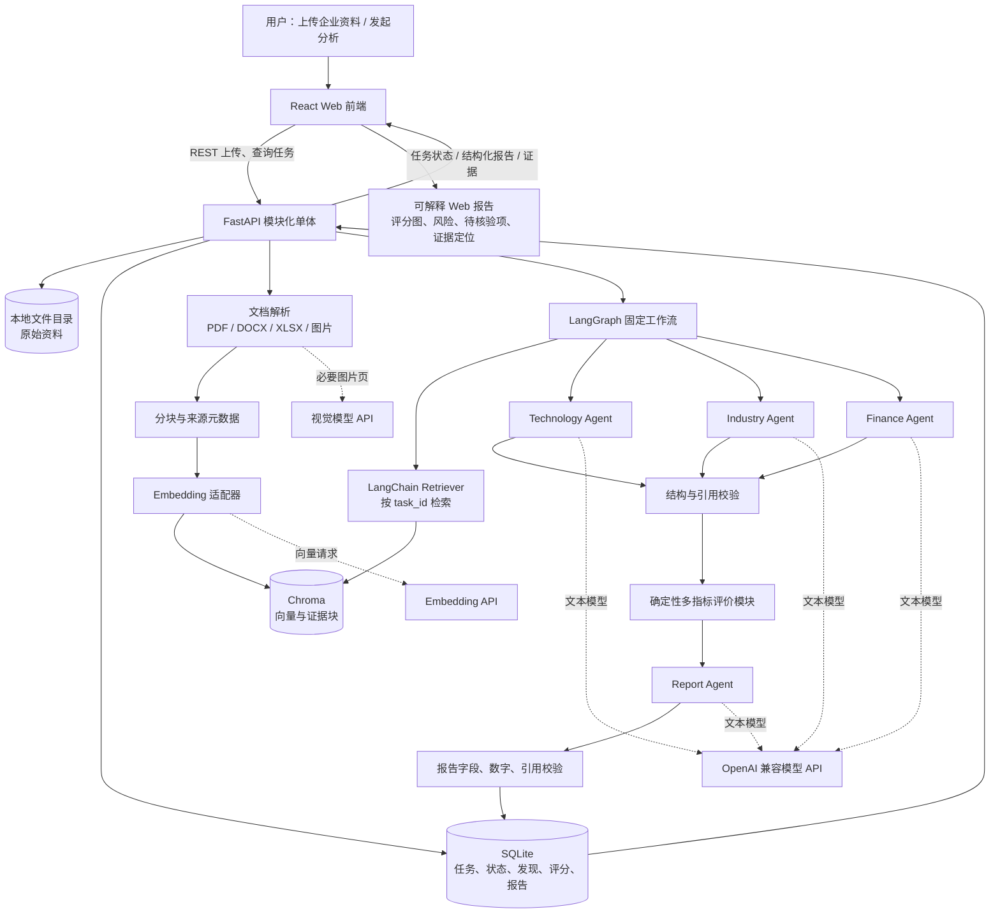

# 科衡第一阶段技术选型说明

## 1. 文档信息

| 项目 | 内容 |
| --- | --- |
| 文档状态 | 第一阶段建议稿，待项目成员确认 |
| 适用目标 | 单人、短周期完成比赛展示版端到端 MVP |
| 评估日期 | 2026-08-22 |
| 输入基线 | `AGENTS.md`、《需求规格说明书》《AI模型设计说明》《系统设计说明书》 |
| 约束 | 本文只进行选型，不代表已经安装、开发或接入任何服务 |

## 2. 选型结论摘要

第一阶段推荐采用“React 单页应用 + FastAPI 模块化单体 + LangChain RAG 组件 + LangGraph 固定工作流 + Chroma 本地向量库 + SQLite/本地文件存储 + OpenAI 兼容模型适配层”的组合。

| 层次 | MVP 推荐 | 选择理由 |
| --- | --- | --- |
| 前端 | React + TypeScript + Vite + Ant Design + ECharts | 组件和图表生态丰富，适合快速形成完成度较高的尽调工作台 |
| 后端 | Python 3.12 + FastAPI + Pydantic + SQLAlchemy | 与 AI 生态同语言，类型校验和自动 API 文档有利于单人及 AI 辅助开发 |
| 文档解析 | PyMuPDF + python-docx + openpyxl；图片/扫描页由视觉模型有限兜底 | 直接覆盖首期常见格式，保留页码和结构，避免先建设通用解析平台 |
| RAG | LangChain 的文档、分块、Embedding、Retriever 抽象 | 与 LangGraph 同一生态，减少同时引入两套 AI 框架的认知和适配成本 |
| Agent 编排 | LangGraph `StateGraph` 固定流程 | 流程、状态和分支显式，适合多专业分析、失败状态和后续人工复核扩展 |
| 向量数据库 | Chroma `PersistentClient` | 本地持久化、元数据过滤、零独立服务，足以覆盖比赛样本规模 |
| 业务数据 | SQLite + SQLAlchemy | 单机、单用户 MVP 运维成本最低，并可通过 ORM 迁移到 PostgreSQL |
| 原始文件 | 受控的本地文件目录 | 比赛阶段简单可控；数据库仅保存路径、哈希、来源和处理状态 |
| 模型调用 | 自建薄适配层调用 OpenAI 兼容 API | 可切换千问、DeepSeek 或本地兼容服务，不让业务代码绑定供应商 SDK |
| 默认模型策略 | 中文通用文本模型 + 视觉模型 +独立 Embedding 模型 | 文本分析、图片理解和向量表示职责分开，便于成本与效果调节 |
| 任务执行 | 同进程受控后台任务 + 数据库阶段状态 + 前端轮询/SSE | MVP 不额外引入 Redis/Celery；失败需显示，演示前可重新执行 |
| 报告 | 结构化 JSON 为事实源，前端渲染 HTML；可选 Markdown 下载 | 便于校验引用、展示图表和后续扩展导出，不先处理复杂 PDF 排版 |

该组合不是生产金融系统的最终架构，而是满足“先打通、可解释、可演示、可替换”的比赛版基线。第一阶段不采用微服务，不部署 Dify/FastGPT 作为主平台，不引入 Milvus、Redis、Celery 或 Kubernetes。

## 3. 选型原则与评价方法

本次选型遵循现有项目规范：先保证端到端可运行，再优化；优先成熟组件；保持模块化；AI 结论必须有证据；新增能力明确目的和影响范围。

候选技术按以下维度进行相对评价：

- **开发效率**：单人完成首条链路的速度、脚手架和调试便利性。
- **学习成本**：对熟悉常规 Web/Python 的学生新增的概念和运维负担。
- **社区成熟度**：文档、生态、案例、维护活跃度和问题可检索性。
- **项目匹配度**：是否支持文档、RAG、结构化输出、证据链和模块替换。
- **比赛展示效果**：能否快速做出稳定、清晰、视觉完整的演示。

评分使用 1～5 级，5 表示在“科衡单人短周期 MVP”条件下更有利。分数是项目情境下的工程判断，不是通用性能排名；开发者已有经验可改变前端和后端的学习成本结论。

## 4. 整体技术架构分析

### 4.1 架构形态

采用“前后端分离的模块化单体”。React 前端只负责上传、状态、证据和报告呈现；FastAPI 提供统一业务 API，并在单个 Python 工程内按任务、文档、RAG、Agent、评价和报告模块划分。AI 框架和数据库均置于适配接口后，不让前端或领域对象直接依赖供应商字段。

模块化单体比微服务更符合当前团队规模：本地只需启动前端和后端两个主进程，SQLite、Chroma 和上传文件都可落在本机。后续只有在并发、数据隔离或团队边界出现实际需求后，再拆分解析工作进程、模型网关或检索服务。

### 4.2 前端方案

推荐 React + TypeScript + Vite，并使用 Ant Design 构建表单、步骤条、表格、抽屉和报告布局，使用 ECharts 展示维度雷达图、得分条和风险分布。

第一阶段页面建议限定为：任务首页、资料上传/处理页、分析进度页、报告详情页。报告详情使用左右或主侧栏布局：主区域显示综合结论与各专业章节，侧栏显示证据原文、页码、置信/不确定性和待核验项。评分只由后端返回，前端不实现正式规则。

选择 React 的主要原因不是其语法天然更简单，而是组件、图表、展示模板和 AI 辅助生成资料丰富，较容易做出比赛需要的完整工作台。若唯一开发者对 Vue 3 明显更熟悉，可等价替换为 Vue 3 + TypeScript + Vite + Element Plus + ECharts，不应为统一偏好重新学习 React。

### 4.3 后端方案

推荐 FastAPI 模块化单体。FastAPI 基于 Python 类型声明和 Pydantic 数据验证，原生生成 OpenAPI/Swagger 文档，并支持异步接口、文件上传和流式响应；这些能力适合同时承载 Web API 和 Python AI 生态。对 Agent、评价与报告统一定义 Pydantic 输入输出模型，可减少自由 JSON 在模块间漂移。

第一阶段后台任务不引入 Celery/Redis。上传后创建任务记录，由后端受控后台执行解析、索引、Agent、评价和报告步骤，每一步把状态和错误写入 SQLite；前端轮询或通过 SSE 显示进度。该方案不具备严格的进程崩溃自动恢复能力，但可显示失败并从任务重新执行，足以支撑单机比赛演示。若需要多人并发或可靠恢复，再迁移到独立 worker 与持久队列。

### 4.4 文档解析方案

首期只支持能够形成稳定演示样本的格式：文本型 PDF、DOCX、XLSX，以及 PNG/JPEG。建议使用：

- PyMuPDF：读取 PDF 文本、页码和页面块，并按页保留引用坐标。
- python-docx：读取 DOCX 段落与表格。
- openpyxl：读取 XLSX 工作表、单元格、公式值和表名。
- 视觉模型：仅对少量图片或扫描页做结构化理解，返回原文件与页码引用。

通用 OCR、复杂跨页表格恢复和任意版式解析都可能吞噬比赛周期。第一阶段应通过一组固定、质量可控的脱敏材料证明多格式和图片能力；解析失败必须显示“无法可靠解析”，不能用视觉模型猜测缺失数字。

### 4.5 RAG 方案

RAG 采用可预测的两阶段检索增强，而不是让 Agent 自主决定是否检索：

1. 文档解析后按标题/段落/页码分块，生成 `document_id`、`page_no`、`section`、`task_id`、`chunk_id` 等元数据。
2. 使用独立 Embedding 模型生成向量并写入 Chroma。
3. 每个专业 Agent 根据预设分析主题生成有限查询，检索时强制按 `task_id` 过滤。
4. 将 Top-K 证据片段及来源元数据作为“证据包”输入模型。
5. Agent 只能引用证据包中的稳定 `chunk_id`，后端校验引用是否存在。

LangChain 提供加载、分块、Embedding、向量库和 Retriever 等模块化抽象，官方文档也明确区分可预测的 2-Step RAG 与更灵活但时延和控制更弱的 Agentic RAG。科衡首期应使用 2-Step RAG；需要查询改写或检索验证时，在固定流程中增加显式节点，而不是直接开放自主循环。

### 4.6 Agent 编排方案

推荐 LangGraph 固定状态图，不使用自由规划型多 Agent。建议状态包含任务标识、资料版本、证据包、技术/产业/财务发现、评价结果、报告草稿、错误和待核验项。

第一版图节点为：

```text
准备分析上下文
  → 技术分析 Agent
  → 产业分析 Agent
  → 财务分析 Agent
  → 结果一致性/引用检查
  → 确定性评价模块
  → Report Agent
  → 报告引用校验
```

为降低调试难度，首版可顺序执行三个专业 Agent；流程稳定后再将其改为并行扇出/汇合。每个 Agent 使用不同系统提示词和输出模式，但共享同一模型适配接口和证据格式。Report Agent 只汇总已存在的发现、评分和限制，不得新增证据外事实。

LangGraph 官方定位包含状态化工作流、持久执行、流式输出和 human-in-the-loop；MVP 只使用显式状态图和条件分支，暂不建设完整检查点恢复和人工中断恢复。

### 4.7 向量数据库方案

推荐 Chroma 本地 `PersistentClient`。它无需单独数据库服务即可把数据保存到指定目录，并支持对 `task_id`、`document_id`、页码等元数据过滤，适合少量企业材料和现场演示。

第一阶段每个证据块同时保存稳定标识、原文、向量和可展示元数据；任务隔离至少采用强制 `task_id` 过滤，不能依赖集合命名或模型提示词。Chroma 本地持久化官方定位主要面向本地开发和测试，因此它是 MVP 选择，不是金融机构生产部署承诺。

### 4.8 数据存储方案

采用三类存储并明确权威边界：

| 数据 | MVP 存储 | 说明 |
| --- | --- | --- |
| 任务、资料元数据、运行状态、结构化发现、评分、报告版本 | SQLite | 业务事实源；通过 SQLAlchemy 隔离数据库方言 |
| 原始上传文件与解析中间文件 | 本地受控目录 | 使用任务/文档稳定标识组织；数据库保存哈希和相对路径 |
| 证据块及向量索引 | Chroma 持久目录 | 用于检索，不替代业务数据库和原始资料 |

报告以结构化 JSON 保存，HTML 由前端渲染；如需下载，第一阶段优先生成 Markdown。严禁把真实密钥写入数据库或仓库，比赛数据必须合成、脱敏或明确获准。

### 4.9 模型调用方式

推荐后端实现一个很薄的模型适配接口，并通过 OpenAI 兼容 HTTP/API 形式调用。配置至少包含 `base_url`、模型逻辑角色、固定模型版本、超时、重试上限、温度和输出模式；密钥只从运行环境注入。

比赛版建议使用国内可稳定访问的云模型服务，候选为：

- 中文文本分析：千问 Plus/Max 等支持结构化输出的通用模型；低成本调试可使用 Flash 档。
- 图片/扫描页：千问 VL 等视觉模型，仅处理必要页。
- 向量：`text-embedding-v4` 等中文 Embedding 模型，MVP 可使用 1024 维作为成本与效果折中。

阿里云百炼官方文档提供 OpenAI 兼容接口，文本与多模态模型支持 JSON/JSON Schema 的范围随模型不同；因此不能只依赖提示词，后端仍需用 Pydantic 校验，并对失败输出进行有限重试或转为“需要人工”。赛前应使用脱敏固定样本确定实际模型和一个固定快照，避免直接依赖不断变化的 `latest` 别名。

若没有云 API 授权或资料不允许出域，可把同一适配接口指向 Ollama/vLLM 等 OpenAI 兼容本地服务，但本地模型质量、显存、启动时间和多模态支持必须提前实测。比赛当天不应临时切换未经回归的模型。

### 4.10 多指标评价与报告

评价模块是普通确定性 Python 领域模块，不属于 Agent。它读取版本化指标和权重，接收已经校验的结构化发现，输出各维度分数、权重贡献、证据、缺失项和配置版本。总分不得由 LLM 自由生成；缺失证据默认标为“未评分/待核验”，不自动按零分处理，除非评审后的规则明确规定。

报告生成分两步：Report Agent 按模式生成章节草稿；后端对字段、数字、引用和评分版本进行校验。最终展示至少包含执行摘要、资料范围、技术/产业/财务分析、雷达图、风险与待核验项、证据索引和“仅作辅助分析”的使用限制。

## 5. 候选技术比较

### 5.1 前端：React 与 Vue

| 候选 | 开发效率 | 学习成本 | 社区成熟度 | 项目匹配度 | 展示效果 | 判断 |
| --- | :---: | :---: | :---: | :---: | :---: | --- |
| React + TypeScript | 4 | 3 | 5 | 5 | 5 | 生态和组件选择最多，适合复杂报告、证据联动与图表；状态管理选择较多，需控制工程复杂度 |
| Vue 3 + TypeScript | 5 | 5 | 5 | 4 | 5 | 模板和响应式上手快，Element Plus 很适合管理界面；若开发者熟悉 Vue，是同等合理的更快选择 |

**推荐：React。** 原因是 AI 辅助开发资料、Ant Design 和可复用展示组件更丰富，利于比赛观感与后续复杂交互。若个人已有 Vue 项目经验明显更强，优先使用 Vue，不为选型一致性牺牲交付速度。

### 5.2 后端：FastAPI、Flask 与 Spring Boot

| 候选 | 开发效率 | 学习成本 | 社区成熟度 | 项目匹配度 | 展示效果 | 判断 |
| --- | :---: | :---: | :---: | :---: | :---: | --- |
| FastAPI | 5 | 4 | 5 | 5 | 5 | Python AI 生态直连；类型校验、OpenAPI、异步与流式能力适合本项目 |
| Flask | 5 | 5 | 5 | 3 | 4 | 最小服务非常快，但数据模型、验证、API 文档和工程约束需自行组合，后期容易补建基础能力 |
| Spring Boot | 2 | 2 | 5 | 4 | 4 | 企业治理与生产能力成熟，但 Java/Python AI 跨栈和启动结构对单人比赛版偏重 |

**推荐：FastAPI。** 它在开发速度与工程约束之间平衡最好。Flask 适合非常小的接口演示，但科衡存在多种结构化契约；Spring Boot 适合已有 Java 团队或机构平台整合，不适合作为当前单人 AI MVP 的默认方案。

### 5.3 RAG：Dify、LlamaIndex、LangChain 与 FastGPT

| 候选 | 开发效率 | 学习成本 | 社区成熟度 | 项目匹配度 | 展示效果 | 判断 |
| --- | :---: | :---: | :---: | :---: | :---: | --- |
| Dify | 5 | 4 | 5 | 3 | 5 | 知识库、工作流、模型管理和可视化齐全，验证很快；自有 Web、证据模式、评分与版本治理需跨平台适配 |
| LlamaIndex | 4 | 3 | 4 | 5 | 4 | RAG/数据摄取定位清晰，文档与索引抽象强；再搭配 LangGraph 会引入两套核心抽象 |
| LangChain | 4 | 3 | 5 | 5 | 4 | Loader、Splitter、Embedding、VectorStore、Retriever 集成广，与 LangGraph 衔接直接；API 面较广，需只采用必要模块 |
| FastGPT | 5 | 4 | 4 | 3 | 5 | 中文环境、知识库和可视化工作流友好，快速展示强；复杂结构化业务契约和自有前端整合控制力较弱 |

**推荐：LangChain 作为 RAG 组件层。** 主要原因是与 LangGraph 共用生态，减少桥接代码；只使用文档、分块、Embedding、Retriever 等稳定边界，不使用一个庞大的万能 Chain。LlamaIndex 是纯 RAG 场景的强备选：若技术验证证明其对项目文档解析、引用或索引管理显著更好，可以用适配器替换 RAG 内部实现。Dify/FastGPT 可用于快速验证提示词或展示工作流概念，但不作为科衡主运行时，避免出现两套任务、权限和版本事实源。

### 5.4 Agent：LangGraph、LangChain Agent 与 Dify Workflow

| 候选 | 开发效率 | 学习成本 | 社区成熟度 | 项目匹配度 | 展示效果 | 判断 |
| --- | :---: | :---: | :---: | :---: | :---: | --- |
| LangGraph | 4 | 3 | 5 | 5 | 5 | 状态、节点、条件、流式与后续持久化明确；需要先设计状态模式 |
| LangChain Agent | 5 | 4 | 5 | 3 | 4 | 工具调用 Agent 起步快，但自主循环对固定尽调流程的时延、复现和证据控制较弱 |
| Dify Workflow | 5 | 5 | 5 | 3 | 5 | 可视化编排和现场讲解很强；与自有后端的状态、测试、评分和版本治理形成额外集成层 |

**推荐：LangGraph 固定工作流。** 科衡的技术、产业、财务、评价和报告顺序稳定，属于 workflow 多于开放式 agent。专业“Agent”体现为不同职责、提示词和结构化契约，不等于必须让模型自由规划。LangChain Agent 可在后期为有限的外部工具研究场景使用；Dify Workflow 适合无代码原型或已有 Dify 平台的团队。

### 5.5 向量数据库：Chroma、FAISS 与 Milvus

| 候选 | 开发效率 | 学习成本 | 社区成熟度 | 项目匹配度 | 展示效果 | 判断 |
| --- | :---: | :---: | :---: | :---: | :---: | --- |
| Chroma | 5 | 5 | 4 | 5 | 5 | 本地持久化和元数据过滤直接可用，零独立服务，适合比赛数据量 |
| FAISS | 4 | 3 | 5 | 3 | 3 | 高效相似搜索库，不是完整数据库；元数据、持久化、删除和任务隔离需自行建设 |
| Milvus | 2 | 2 | 5 | 4 | 4 | 大规模、过滤、多租户和水平扩展能力强；部署与运维远超 MVP 需要 |

**推荐：Chroma。** 它对 MVP 的价值在于最少基础设施而不是极限性能。FAISS 适合算法实验或需要精细索引控制的场景，但直接使用会产生大量外围工作；Milvus 在向量规模、并发和高可用需求出现后再评估。后续迁移通过项目自己的 `VectorStore` 适配接口完成。

### 5.6 模型调用方式

| 方式 | 开发效率 | 本地运维 | 数据可控性 | 模型效果/更新 | 比赛适用性 | 判断 |
| --- | :---: | :---: | :---: | :---: | :---: | --- |
| 云端 OpenAI 兼容 API | 5 | 5 | 2 | 5 | 5 | 最快获得中文、多模态和结构化输出能力；只可处理获准出域的脱敏比赛资料 |
| Ollama 本地服务 | 4 | 4 | 5 | 3 | 3 | 部署直观、数据本地；效果、显存、速度和多模态能力依赖设备 |
| vLLM 自托管 | 2 | 2 | 5 | 4 | 3 | OpenAI 兼容且吞吐扩展强；需要 GPU、模型和推理运维能力 |
| Dify/FastGPT 模型网关 | 4 | 2 | 3 | 4 | 4 | 统一模型配置便利，但为了一个 MVP 增加平台部署与状态边界 |

**推荐：云端 OpenAI 兼容 API + 项目内薄适配层。** 比赛资料必须脱敏并获得使用许可。保留本地 OpenAI 兼容地址作为备选，但不在首版同时维护两条未经测试的运行路径。

## 6. MVP 架构图



### 6.1 关键边界

- 前端不直接访问模型、Chroma 或文件目录。
- RAG 返回的是带稳定来源标识的证据包，不是只有文本的搜索结果。
- Agent 只产生结构化分析发现，不直接修改评分或报告发布状态。
- 评价模块是确定性规则，Report Agent 不生成总分。
- SQLite 是业务事实源；Chroma 可重建，不能成为任务或报告唯一存储。
- 所有模型响应必须经过模式校验；证据不足和调用失败是正常业务状态。

## 7. 第一阶段开发建议

### 7.1 第一阶段必须实现

以一套脱敏企业样例作为纵向切片，按以下顺序打通：

1. **任务与上传**：单用户创建企业尽调任务，上传有限格式文件，显示文件清单和状态。
2. **可定位解析**：解析 PDF/DOCX/XLSX/图片，至少保留文件名、页码/工作表和片段标识；失败可见。
3. **基础 RAG**：分块、Embedding、Chroma 持久化、按任务过滤、Top-K 检索和证据预览。
4. **三个专业 Agent**：技术、产业、财务分别输出固定 JSON 模式，包括结论、类型、证据 ID、不确定性和待核验项。
5. **引用校验**：拒绝不存在、跨任务或不在本次证据包中的引用；低证据结论明确标记。
6. **基础评价**：使用版本化指标和权重形成可重复的维度评分与解释，缺失项不由模型自动补值。
7. **报告整合**：Report Agent 生成结构化章节，后端校验后保存；页面展示摘要、专业章节、雷达图、风险与证据。
8. **过程展示**：前端步骤条展示“上传—解析—索引—专业分析—评价—报告”，失败时显示阶段和原因。
9. **最小回归样本**：为固定演示材料保存预期关键证据、至少一个证据不足场景和一个冲突场景。
10. **演示保障**：准备可重复导入的脱敏样例、缓存/预生成应急方案和不依赖临时外部搜索的讲解路径。

第一阶段的成功标准不是“Agent 数量多”，而是一次运行能够从资料到报告闭环，并且评委点击一条重要结论时能看到支持它的原文件、位置、分析类型和评分依据。

### 7.2 第一阶段暂时不要实现

- 不建设微服务、Kubernetes、多机高可用或通用 AI 中台。
- 不同时引入 LangChain、LlamaIndex、Dify、FastGPT 多套主运行时。
- 不实现开放式多 Agent 自主规划、无限反思循环、自动联网研究或任意代码执行。
- 不追求任意格式、全量 OCR、复杂跨页表格、音视频和批量历史资料接入。
- 不接入工商、司法、专利、新闻、市场等未经确认授权的外部数据源。
- 不建设完整多租户 RBAC、机构身份源、电子签章、正式审批和审计防篡改。
- 不引入 Redis/Celery、Milvus、对象存储或 PostgreSQL，除非实际演示规模已经证明需要。
- 不实现精美 PDF/Word 报告排版、报告差异合并和复杂协同编辑。
- 不做在线学习、微调、自动权重优化或让 LLM 直接决定总分。
- 不用虚构的性能、准确率或置信度作为比赛宣传；评测结果必须来自固定样本。

### 7.3 推荐开发节奏

| 迭代 | 目标 | 可演示成果 |
| --- | --- | --- |
| Iteration 1 | 固定资料完成解析、分块、检索和证据定位 | 输入问题可返回带页码证据 |
| Iteration 2 | 完成一个 Technology Agent 与结构校验 | 技术结论可回溯证据，证据不足可拒答 |
| Iteration 3 | 增加 Industry/Finance Agent、评价和 Report Agent | 单次运行产出结构化综合报告 |
| Iteration 4 | 完成 React 工作台、进度和评分/证据联动 | 可供评委操作的端到端 Web Demo |
| Iteration 5 | 固定样本回归、异常路径和演示保障 | 重复运行稳定，失败可解释，有应急预案 |

每个迭代都保持可运行；先用一份资料和一个 Agent 验证数据契约，再扩展到完整流程，不应等所有模块写完后首次联调。

## 8. 后续扩展路线

### 8.1 从比赛版到多人试点

- SQLite 迁移到 PostgreSQL，本地文件迁移到 MinIO/S3 兼容对象存储。
- 同进程任务迁移到 Redis + RQ/Celery 或其他持久任务队列，解析与 Agent 使用独立 worker。
- Chroma 迁移为服务模式；数据规模、并发和隔离需求达到阈值后评估 Milvus 或其他生产向量库。
- LangGraph 增加持久 checkpoint、人工中断/恢复、步骤重试和并行专业 Agent。
- 接入组织身份源、细粒度权限、审计、报告审批和版本冻结。

### 8.2 提升 RAG 和多模态能力

- 增加 OCR、版面理解、表格结构恢复和解析质量评分。
- 从纯向量检索演进为关键词 + 向量混合检索，并增加中文 reranker。
- 建立检索金标准，按文档类型调节分块策略和 Top-K，而非凭单例调参。
- 对图片、图表、表格建立独立证据表示；关键财务数字增加勾稽和人工复核。

### 8.3 提升模型与评价治理

- 建立统一模型路由、调用预算、重试、缓存、追踪和供应商切换回归。
- 对模型、提示词、Embedding、知识库、指标和权重进行完整版本冻结。
- 建设分行业、分企业阶段的指标与权重集，进行专家评审和敏感性分析。
- 建立解析、检索、引用、专项分析、报告和安全的固定评测集与发布门禁。

### 8.4 架构演进触发条件

扩展不按“看起来更专业”启动，而按可测证据触发：SQLite 出现并发写瓶颈才迁 PostgreSQL；单机任务无法满足演示/试点吞吐才引入队列；Chroma 在数据量、过滤、隔离或可用性上不满足目标才迁移 Milvus；只有固定工作流确实无法处理开放研究任务时，才增加自主 Agent。

## 9. 主要风险与应对

| 风险 | 对 MVP 的影响 | 应对 |
| --- | --- | --- |
| 模型 API 不稳定或限额 | 演示中断 | 固定模型快照、超时与有限重试、预热、脱敏演示结果缓存和明确降级页面 |
| 文档版式复杂 | 证据和数字错误 | 首期限制格式，按页保留原文，低质量解析转人工/视觉兜底 |
| Agent 输出 JSON 不稳定 | 流程无法进入评价 | 结构化输出 + Pydantic 校验 + 一次修复重试，仍失败则显示失败状态 |
| 错误或虚构引用 | 失去项目可信度 | 只允许引用检索证据 ID，生成后做存在性、任务域和支持关系校验 |
| 三个 Agent 耗时过长 | 现场等待体验差 | 先顺序保证稳定，再并行；使用成本合适的模型，显示阶段进度，准备固定样例 |
| 评分被误解为正式结论 | 展示风险 | 显示规则版本、权重、证据、缺失项和辅助分析声明 |
| 框架 API 快速变化 | 开发返工 | 锁定依赖版本、只用窄接口、用项目适配器隔离 LangChain/Chroma/模型 |

## 10. 最终推荐与备选

### 10.1 推荐基线

```text
React + TypeScript + Vite + Ant Design + ECharts
FastAPI + Pydantic + SQLAlchemy + SQLite
PyMuPDF + python-docx + openpyxl
LangChain RAG components + Chroma PersistentClient
LangGraph fixed StateGraph
OpenAI-compatible cloud LLM/VLM/Embedding adapters
Structured JSON report + Web rendering
```

### 10.2 允许的替换

- 开发者明显熟悉 Vue：将 React/Ant Design 替换为 Vue/Element Plus，其余边界不变。
- LlamaIndex 在代表性资料验证中明显提升引用或摄取质量：通过 RAG 适配接口替换 LangChain 内部实现，不同时保留两条主链路。
- 比赛环境不能调用云模型：切换到经过固定样本验证的 OpenAI 兼容本地模型服务，接受可能的效果与速度差异。
- 需要纯低代码极速原型且不建设自有 Web：可选择 Dify 或 FastGPT，但这将成为另一条产品路线，不能与本推荐架构无边界混合。

## 11. 选型决策检查点

进入编码前，应由项目成员确认以下五项：

1. 唯一开发者对 React/Vue 和 Python 的实际熟悉度。
2. 比赛运行设备、网络、GPU、云模型账号与可用额度。
3. 允许出域的数据范围，以及演示资料已完成脱敏/授权。
4. 首期文件格式、最大页数和固定演示样本。
5. 选定文本、视觉、Embedding 模型及固定版本，并完成最小结构化输出试验。

若上述条件变化，应更新本文并说明目的、影响范围和回退方案，不应在业务代码中静默更换核心组件。

## 12. 官方资料参考

以下资料用于确认候选技术的定位和当前能力；具体版本与许可证应在实际安装前再次核对：

- [React 官方文档：Quick Start](https://react.dev/learn)
- [Vue 3 官方文档：Introduction](https://vuejs.org/guide/introduction.html)
- [FastAPI 官方文档：Features](https://fastapi.tiangolo.com/features/)
- [Flask 官方文档](https://flask.palletsprojects.com/en/stable/)
- [Spring Boot 官方项目页](https://spring.io/projects/spring-boot/)
- [LangChain 官方文档：Retrieval 与 RAG 架构](https://docs.langchain.com/oss/python/langchain/retrieval)
- [LangGraph 官方文档：Overview](https://docs.langchain.com/oss/python/langgraph/overview)
- [LangGraph 官方文档：Workflows and agents](https://docs.langchain.com/oss/python/langgraph/workflows-agents)
- [LlamaIndex 官方文档：Loading Data](https://docs.llamaindex.ai/en/stable/understanding/loading/loading/)
- [Dify 官方文档：平台与知识库介绍](https://docs.dify.ai/guides/knowledge-base/retrieval)
- [Dify 官方文档：Workflow Quick Start](https://docs.dify.ai/en/guides/application-orchestrate/creating-an-application)
- [FastGPT 官方文档：Quick Start](https://doc.fastgpt.io/en/guide/getting-started/quick-start)
- [Chroma 官方文档：Clients 与本地持久化](https://docs.trychroma.com/docs/run-chroma/cloud-client?lang=python)
- [Chroma 官方文档：Metadata Filtering](https://docs.trychroma.com/docs/querying-collections/metadata-filtering)
- [FAISS 官方项目说明](https://github.com/facebookresearch/faiss)
- [Milvus 官方文档：Overview](https://milvus.io/docs/overview.md)
- [阿里云百炼官方文档：结构化输出](https://help.aliyun.com/zh/model-studio/qwen-structured-output)
- [阿里云百炼官方文档：Embedding](https://help.aliyun.com/en/model-studio/embedding)
